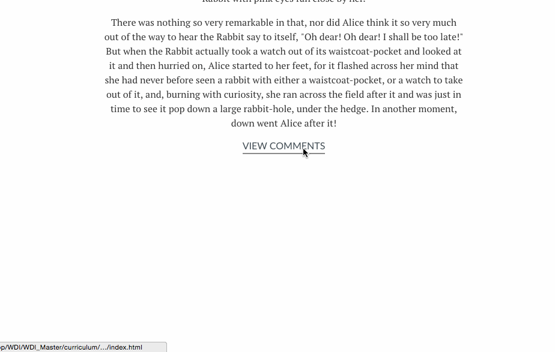

# 

| Title | Type | Duration | Author |
| -- | -- | -- | -- |
| JavaScript Events | Lesson | 2:30 | Sonyl Nagale (adapted from SEI) |


### Learning Objectives

*After this lesson, students will be able to:*

- Explain the concept of a "callback" and how we can pass functions as arguments to other functions.
- Explain why callbacks are important to asynchronous program flow.
- Write event handlers for common events.
- Define what `this` represents in the context of an event listener.
- Utilize the event object to find out about events that have occurred and prevent the default action on anchors and submit buttons.

### Student Pre-Work

*Before this lesson, students should already be able to:*

- Access elements in the DOM using JavaScript.
- Add and remove elements using JavaScript.
- Edit existing elements in the DOM using JavaScript.

### Instructor Prep
*Before this lesson, instructors will need to:*
- Read through the lesson.
- Add additional instructor notes as needed.
- Edit language or examples to fit your ideas and teaching style.
- Open, read, run, and edit (optional) the starter and solution code to ensure that it's working and you agree with how the code was written.

### Lesson Guide

| TIMING  | TYPE  | TOPIC  |
|:-:|---|---|
| 5 min  | Opening | JavaScript Events |
| 5 min  | Introduction | What Is Asynchronicity? |
| 10 min  | Independent Practice  | What Is an Event? |
| 10 min  | Demo  | Setting Up an Event Handler |
| 10 min  | Independent Practice  | Color Scheme Switcher  |
| 10 min  | Demo | Types of Events |
| 10 min  | Independent Practice  | Adding Event Handlers  |
| 10 min  | Demo | Event Handlers: `this` |
| 10 min  | Independent Practice | Event Handlers: `this` |
| 15 min  | Demo | The Event Object |
| 10 min  | Independent Practice | Timing Functions |
| 10 min  | Demo | Asynchronicity With Timers |
| 15 min  | Independent Practice | TimerJS |
| 5 min | Conclusion | Summary |
| 15 min | Demo | Bonus Topics |


---

## Opening (5 min)

In order to create interactive and responsive sites, we'll often want to update the DOM based on our user's actions.

For example, when a user _clicks_ on our site's menu icon, a sidebar menu should slide out from the side of the page. Or if a user _types_ an incorrect format into a form field, that field should become outlined in red.

These actions are called **events**.


Take a look at this short [video](https://generalassembly.wistia.com/medias/yf3g289u45), which provides an overview of events' usefulness in JavaScript.

---

## What Is Asynchronicity? (5 min)

JavaScript is different than most other programming languages because it is designed specifically to work in the event-driven environment of a browser window.

JavaScript is not just executed line-by-line and then forgotten. When a browser loads HTML and CSS, it then uses its interpreter to run your JavaScript.

JavaScript typically will run top-to-bottom. As developers, however, we have no idea when the code related to the button-click will actually be executed. _It's totally dependent on the user_. We need code that will wait around until a user decides to click something.

Therefore, we need to write code that will execute **asynchronously**; in other words, outside of the typical top-to-bottom document flow while not holding up the rest of our application.

Once your JavaScript has fully loaded, it lives in the background of your browser window, waiting and **listening** for any event triggers you've programmed.

As its name implies, in **event-driven programming**, the flow of a program is driven by events.

This means:

*   The program continually "waits" or listens for events to occur.
*   There are many kinds of events, such as clicking, tabbing into a form field, pressing down a keyboard key (or letting a keyboard key up), scrolling, resizing the browser window, etc. We'll take a look at some of these events later in this lesson.
*   The event acts as a "trigger," which calls (or runs) a function.

---

## Independent Practice: What Is an Event? (10 min)

But first, a question for you: **What is an event (on a webpage)?** Spend two minutes completing the following tasks. You are encouraged to discuss your findings with a partner during the exercise.

1. Come up with your own definition without looking at any other sources. Don't worry about getting it right; what do you **think** an event is?
2. Now, find (i.e., google) some documentation on JavaScript events. Does that information match your definition? How would you change it?
3. Write down three examples of an event.
4. Make it real! Find a real example online of how those events occur.

> If you need some help, you can find information on events and examples from [W3Schools](http://www.w3schools.com/js/js_events.asp) and [Mozilla Developer Network](https://developer.mozilla.org/en-US/docs/Web/Events).

---

## Setting Up an Event Handler (10 min)

How do we set up, or write, event handlers?

We mentioned previously that we can set up **event handlers** in our scripts that will listen, or wait, for an event to occur and then trigger a function.

### Syntax

The syntax for setting up an event handler looks like this:

```js
element.addEventListener('nameOfEvent', functionToRun);
```

Let's look at the different pieces of that:

1. `element`: Refers to the DOM node with which we want to tie the event. For example, if we want to trigger an event when the user clicks on a button, the element would be that button element.  
2. `.addEventListener()`: This is the method we'll use to tie an event listener to an element.
3. `'nameOfEvent'`: This is the event to which we'll want to listen. For example, maybe we want to wait until the user triggers a `'click'` event. In that case, we would put the string `"click"`.
4. `'functionToRun'`: This is the name of the function we want to run when the event occurs. When we pass a function as an argument to another function (as we are here), this is what is referred to as a **callback function**.
	- _Note: There are no parentheses after the function name._  
		- It's `functionToRun`, not `functionToRun()`.
		- If we were to include `()`, we invoke the function expression immediately, not after the user interacts with the page.
		- Without the `()`, we're using the function expression as a reference; we're just passing that function along for later use.


#### Example

Let's take a look at an example of an event handler:

```js
const alertUser = function () {
  alert('Button has been clicked!');
}

const button = document.querySelector('button');

button.addEventListener('click', alertUser);
```

Let's break it down:

1. Set up a function that will be triggered when the event occurs (`alertUser`).
2. Find the element we want to tie the event to and save it to a variable (the button).
3. Finally, set up an event handler using `addEventListener()`.

In the example above, when the user clicks on the button, the `alertUser` function will run.

---

## Independent Practice: Color Scheme Switcher (10 min)

It's time to get some practice creating event handlers:

1. Open the [starter\_code > color\_scheme\_switcher](starter_code/color_scheme_switcher) folder in your text editor.
2. **Turn and Talk**: Take a look at the code that has been provided to you in `main.js` and `style.css`. What do you think will happen when the functions `turnRed`, `turnWhite`, `turnBlue`, and `turnYellow` run?
3. Add event handlers to the `main.js` file so that, when a user clicks on one of the colored dots, the background color of the entire page changes to match that dot. You shouldn't have to change any HTML or CSS.

> **Note**: Notice how much repeated/similar code is in our `main.js` file. Later in this lesson, we'll look at how we can refactor this code and make it more DRY.

> DRY stands for "Don't repeat Yourself," and refers to keeping our code as simple and elegant as possible.

---

## Types of Events (10 min)

There are many events that can trigger a function. Here are a few:

|  Event | Description  |
|---|---|
| `'click'`  | When the button (usually a mouse button) is pressed and released on a single element.  |
| `'keydown'`  | When the user first presses a key on the keyboard.  |
|  `'keyup'` | When the user releases a key on the keyboard.  |
| `'focus'`  | When an element receives focus.  |
| `'blur'`  |  When an element loses focus. |
|  `'submit'` | When the user submits a form.  |
|  `'load'` | When the page has finished loading.  |
|  `'resize'` |  When the browser window has been resized. |
|  `'scroll'` |  When the user scrolls up or down on a page. |
| `'mouseenter`' | When the user's mouse enters an element. |
| `'mouseleave'` | When the user's mouse leaves an element. |

### Example

Say we've created a simple form that allows users to subscribe to our email newsletter. When the user _tabs or clicks away_ from the email input field, we want to make sure the user has entered a value in the field.

Here's a simple HTML snippet of an email form:


```html
<form>
	<h1>Email Form</h1>
	<input id="email" type="email" placeholder="Email Address">
	<button type="submit">Subscribe</button>
	<p id="message"></p>
</form>
```

The form contains an input field where the user can enter an email address, a button for submitting the form, and a paragraph with the id _message_ that currently doesn't contain any text.

Our style sheet is also very basic.

Take a look at the `error` class, which will give a solid red border to any elements that have the `error` class:

```css
.error {
    border: 2px solid #fa4542;
}
```

Now let's take a look at the event handler in our JavaScript:

```js
// First in our JS, let's find the email input field.
const emailInputField = document.getElementById('email');

// Next up in our JavaScript, let's add our event handler, which will trigger the function when the user
// hits tab or clicks out of the email field (the 'blur' event).
emailInputField.addEventListener('blur', checkEmailInput);

// And finally, in our JavaScript, let's go ahead and set up that function we want to run when the 'blur' event occurs, checkEmailInput:
function checkEmailInput () {

    // Check to see whether the user has entered a value to the email field.
    if (emailInputField.value.length === 0) {
        // If the email field is blank, display a message to the user.
        document.getElementById('message').innerText = 'Please enter an email address.'

        // Add an error class to the input field that will give it a red border.
        emailInputField.className = 'error';
    } else {
        //Otherwise, clear out the error message.
        document.getElementById('message').innerText = '';

        // Remove the error class from the input field.
        emailInputField.className = '';
    }

}
```

Let's examine what the page looks like when the user hits the `tab` key or clicks away from the email field without entering any information.


The email input now has the `error` class, giving the input field a red border.

We've also added a message in the paragraph with a `message` ID, alerting the user that they need to enter an email address.

---

## Independent Practice: Adding Event Handlers (10 min)

It's time to get some practice creating event handlers.

- Open the [starter_code/event\_listener\_practice](starter_code/event_listener_practice) folder in your text editor. We've provided you with three files: `index.html`, `style.css`, and `main.js`.
- Your job is to add event handlers to create the following functionality:

	* When the user hovers a mouse cursor over the `<div>`, the background of the page should turn blue.
	* When the user's mouse cursor is no longer hovering over the `<div>`, the background of the page should turn white.  

- You've been provided with two functions, `changeBackgroundColorToBlue` and `changeBackgroundColorToWhite`, that can be used as callbacks. You do not need to change the content of these functions.  

---

## Event Handlers: `this` (10 min)

As we saw in a previous lesson, the `this` keyword refers to the object that "owns" the function that the executed code runs within.

It's important to remember that, when we have a method that is inside an object, `this` refers to the object that contains that method.

For example, in the function below, `this` refers to the object that contains the `makeNoise` method `rover`:

```js
const rover = {
  name: 'Rover',
  species: 'dog',
  breed: 'Golden Retriever',
  noise: 'bark',
  makeNoise: function () {
    console.log(this.noise);
  }
}
```

However, when a callback function is executed within the context of an event handler, it is the **element (the DOM node)** that owns the context.

So, in this case, `this` will refer to the element we selected when we set up our event handler.

Let's look at an example where we'll change the background color of a circle from blue to red just by clicking on it:

**HTML:**

```html
<div class="circle"></div>

```

**JS:**

```js
document.querySelector('.circle').addEventListener('click', turnRed)

function turnRed () {
	this.style.backgroundColor = "red";
}
```

When we click on the circle and trigger the `turnRed` function, `this` will refer to the element with the `circle` class within the `turnRed` function.

Here's what that looks like in action:


OK, but why use the `this` keyword...

`this.style.backgroundColor = "red";`

...instead of just writing:

`document.querySelector('.circle').style.backgroundColor = "red";`

Well, let's imagine that there are several circles on our page, and we only want the `.circle` we just clicked to have the updated red background color. This is where the `this` keyword really becomes useful.

Let's take a look:

```js
// Select all elements with the .circle class on the page.
const circles = document.querySelectorAll('.circle');

// Loop through each .circle element and add an event handler.
for (const i = 0; i < circles.length; i++) {
	circles[i].addEventListener('click', turnRed);
}

function turnRed () {
	this.style.backgroundColor = "red";
}
```

Here we're adding an event handler to each element with the `.circle` class.

When an element with the `.circle` class is clicked, the `turnRed` function will be called; within that `turnRed` function, `this` will only refer to the `.circle` that triggered the `turnRed` function and not to any of the other circles.

Let's see this in action:


See how we are only adding the style attribute to the circle we are currently clicking on (i.e., the one that triggered the callback function)? Pretty cool, huh?

---

## Independent Practice: `this` (10 min)

It's time to get some practice using the `this` keyword.

Work through this exercise with a partner. If you finish early, start on the bonus challenge below!

- Open the [starter_code/color\_scheme\_switcher\_part\_2](starter_code/color_scheme_switcher_part_2) folder in your text editor. We've provided you with three files: `index.html`, `style.css`, and `main.js`.
- Follow the instructions in the `main.js` file.
- You should only need to write code within the `switchTheme` function.

**Bonus Challenge Instructions**

Go ahead and try your hand at this exercise with a little less guidance:

- Open the [starter\_code > color\_scheme\_switcher](starter_code/color_scheme_switcher) folder in your text editor that you were working from earlier.
- Refactor the code using the following guidelines:
	- Use `querySelectorAll` to select all `li`s on the page.
	- Loop through all list items and add an event listener to each of them. When a `li` is clicked, call the `switchTheme` function.
	- Create the `switchTheme` function. When the function runs, use the `this` keyword to get the `className` on the button that was just clicked, and update the `className` on the `body` to that class.

---

## The Event Object (15 min)

Now that we've gotten the hang of writing event handlers, let's talk a bit about the event object.

When an event occurs, we might want to find out some information about it.

For example, which element did the user interact with to cause the event? What type of event was it? A `'click'` event? A mouseover?

Luckily, we can use the **event object** to obtain this kind of information.

Watch this short [video](https://generalassembly.wistia.com/medias/j2rme61inj) for an overview of the event object.

### Accessing the Event Object

How do we gain access to the event object?

First, we will need to pass the event object as a parameter.

Take a look at this example:


Now, if we simply use whichever parameter name we chose (in our case, `e`) from within the function, we have access to the event object.

Examine what the event object looks like when you log it to the console and notice all of the properties we have available to us as part of the event object:


We'll take a look at a few of these properties, but for now, just note how much information about the event the event object holds.

### `preventDefault()`

Now, let's discuss another important use of the event object: `preventDefault()`.

As you may be able to tell from its name, `preventDefault()` allows us to prevent the default behavior of an event.

Some events, such as clicking on a link or submitting a form, are meant to take a user to another page. If no URL is specified, the page will simply load at the top.

But maybe when a user clicks on a link or submits a form, we don't want to take them to another page. Instead, we want to fade in some comments.

To do that, we could type:

**HTML:**

```html
<a href="#">View Comments</a>
```

**JS:**

```js
document.querySelector('a').addEventListener('click', viewComments);


function viewComments (e) {
	// Add a class that fades the comments in by changing the opacity to 1.
	document.querySelector('#comments').className = 'show-comments';
}
```

Our comments are added at the bottom (as we had intended), but we don't want the page to jump to the top!



We want to override the default functionality of a link and have comments appear instead of taking the user to another page.

To prevent this default behavior, we can use the `preventDefault()` method:

```js
document.querySelector('a').addEventListener('click', viewComments);

function viewComments(e) {
	// Prevent page from jumping to the top.
	e.preventDefault();

	document.querySelector('#comments').className = 'show-comments';
}
```

Again, we're passing the event object as a parameter to our callback function.

Notice how, within the function, we called the `preventDefault()` method on the event object using dot notation:

`e.preventDefault();`

Let's take a look at the result:


You'll often use this method when you have _anchors_ or _submit buttons_ on a page that you want to provide with some JavaScript functionality, instead of having them take you to another page.

### Event `target`

We can use dot notation to access those properties, as we did when working with objects:

```js
document.querySelector('a').addEventListener('click', viewComments);

function viewComments (e) {
	// To access a property of the event object, we can use dot notation:
	const eventTarget = e.target;

	// Log the target to the console.
	console.log(eventTarget);
}
```

Here, we access the target of the event by using dot notation, `e.target`. Then, we log the target to the console.

Let's take a look at what we see in the console:

`<a href="#">View Comments</a>`

Aha! That's the target of the event, or the element we clicked that caused the event to fire.

### `type`

Or, maybe we want to find out what type of event it was. We can figure this out by using the `type` property. Here, we access the type of event using `e.type`. Take a look:


```js
document.querySelector('a').addEventListener('click', viewComments);
function viewComments (e) {
	// To access a property of the event object, we can use dot notation:
	const eventType = e.type;
	console.log(`The event type is: ${eventType}`);

}
```

And here's what we see in the console: `click`.

---

## Independent Practice: Timing Functions (10 min)

Let's look at timing functions; that is, JavaScript's way of making something happen every `x` seconds.

In your starter code folder, open the [timing\_functions](starter_code/timing_functions) folder.

Take a look at the code that has been provided in the `main.js` file:

```js
function sayHello(){
  console.log("Hi there!")
}
setInterval(sayHello, 1000);
```

### Turn and Talk

Open the `index.html` file in your browser and open the console.

Refresh the page. Spend two minutes observing and answering the following questions:

* What does `setInterval` do?
* What does the number in `setInterval` indicate?
* Replace `setInterval` with `setTimeout`. What's the difference?

We'll make it more interesting by having the timer start on a `'click'` event and stop on another `'click'` event.

Take a look at the "Start" and "Stop" buttons that have been provided in your HTML...

```html
<button id="start">Start</button>
<button id="stop">Stop</button>
```

Replace the contents of your `main.js` with this...

```js
// Represent the "Start" and "Stop" buttons in JavaScript.
const start = document.querySelector('#start');
const stop = document.querySelector('#stop');

start.addEventListener('click', startTimer);
stop.addEventListener('click', stopTimer);

// Create a variable that will store our timer.
let songTimer;

// Create a callback function that prints something to the console.
function singAnnoyingSong() {
  console.log("I know a song that gets on everybody's nerves...");
}

// Create an event listener for the startTimer() function that will print something to the console every tenth of a second.
function startTimer() {
  songTimer = setInterval(singAnnoyingSong, 100);
}

function stopTimer() {
  clearInterval(songTimer);
}
```

> We define `songTimer` outside of the final two event listeners because we need to be able to access it within both event listeners. In order to do so, we must make it a _global_ variable.

### Turn And Talk

Refresh the page. Observe and spend a few minutes answering the following questions:

**What happens when you click the "Start" button a bunch of times in a row?**

* Why?
* When you do this, why doesn't the "Stop" button seem to work?

**What does `clearInterval()` do?**

---

## Demo: Asynchronicity With Timers (10 min)

Run the next bit of code to see asynchronous program execution:

```js
function anAsyncFunction (){
  console.log("hello");
  setTimeout(function (){
    console.log("this is happening in the middle");
  }, 5000)
  console.log("goodbye");
}

anAsyncFunction();
```

Wait, what? The `"goodbye"` came before the `"this is happening in the middle"`!

With everything else we've seen, JavaScript executes one line of code; when that line is done, it executes the next line of code. This is called being **synchronous**.

However, some operations in JavaScript are **asynchronous**, meaning JavaScript goes to the next line of code without waiting for the previous line to complete.

**Why doesn't JavaScript wait for these operations to complete before going to the next line of code?**

Because otherwise the webpage would just "hang" until the operation completes. The browser can't do anything while JavaScript is actively running. We've seen this when we've encountered infinite `while` loops. Asynchronicity is a way of preventing the computer from freezing.

This risk is greatest when JavaScript is making requests to other webpages. There's no way of knowing how long the request will take to complete. It could be near-instant, but if the target server is having a bad day, it could take who-knows-how-long. You don't want the operability of your computer to be at the mercy of some random computer somewhere else.

In this small app we made, anything we want to make sure happens **after** those five seconds of computing should go inside the callback of the `setTimeout()`. This way, we're certain that it will run only when the five seconds are up.

---

## Independent Practice: TimerJS (15 min)

Let's get some practice with timing functions!

Take a look at the instructions in [starter\_code/timer\_js](starter_code/timer_js/README.md).

-------

## Conclusion (5 min)

As we wrap things up, watch this short [video](https://generalassembly.wistia.com/medias/p89saznrue) in which a developer talks about the role events played in a recent project she worked on.

In this lesson, we learned how we can react to our users' actions when they visit our site.

We saw how we can harness JavaScript's event handling to wait until the user takes an action (such as clicking on a button or scrolling down the page) and then run a block of code, or a function, when this event occurs.

We also saw how we can use the `this` keyword to access the individual element that caused an event to fire.

We learned that we can gain access to the event object by passing it in as a parameter to a callback function. This gives us access to the properties and methods tied to the event object from within that callback function.

Up until this point, we've been writing things out in "plain vanilla" JavaScript.

In the next lesson, we'll take a look at how we can harness the power of jQuery to write JavaScript that will work in different browsers, in a much friendlier syntax.

-----

## Bonus Topic: Event Flow

Now that we have a good feel for what the event object is, let's go ahead and look at a concept that is central to event handling in JavaScript: event flow.

We've seen in the past that HTML elements can be nested inside other HTML elements. When we say "nested," we mean that one element can wrap another element.

Take a look at a quick refresher:

```html
<h1>Popular memes for 2016</h1>

<ul>
	<li><a href="">Hotline Bling</a></li>
	<li><a href="">Katy Perry's Left Shark</a></li>
	<li><a href="">Lil Mama Crying</a></li>
	<li><a href="">Pizza Rat</a></li>
	<li><a href="">What's Good?</a></li>
</ul>
```

Here we have a `ul` wrapping five `li`. Each `li`, in turn, is wrapping an anchor.

In other words, we could say that each `a` is nested inside of an `li` and each `li` is nested inside the `ul`.

When we hover over an anchor and click on it, JavaScript can trigger any events that are tied to the anchor, as well as any events that are tied to any elements the `a` is nested within (i.e., the `li` it sits within the `ul` it is also nested within).

If we zoom out a bit and remember the DOM tree, we will recall that our `ul` is nested inside the `body`, which is nested inside the `html`, which is nested inside the `document` object.

Events that are bound to any of these elements will trigger when we click on the `a`.


The order in which these events fire is called **event flow**.

#### Event Bubbling

**Event bubbling** is when the event starts at the most specific element node and then flows outward toward the least specific node.


Here, the event will start at the `a`, the most specific node, and then work its way outward, triggering any events that might be tied to the `li`, then the `ul`, then the `body`, then, finally, the `document` (in this case, the HTML doc).

#### Why Does This Matter?

Understanding event flow comes into play when the code has event handlers that are tied to the element that triggers the event, as well as any of its ancestors or descendants.

Take a look at our example from before. We've gone ahead and tied an event handler to the `a`, `li`, `ul`, `body`, and `document` elements that append a paragraph element to the `body`, which states "[element name] has been clicked."


The order in which those messages are appended to the `body`: `"Anchor has been clicked"` is appended first and `"Document has been clicked"` is appended last, as the events are flowing outward from the most specific element.

The key concept here is that _events are triggered not only for the element that we tie the event handler to, but also for any elements in which that element is nested_.

The flow in which these events occur is from the _most specific_ element to the _least specific_ element (outward in the diagram).

#### Event Propagation

Now, let's talk about `stopPropagation()`.

There may be instances where we don't want an event to bubble up to its ancestors.

If we want to stop this behavior, we can use the event object's `stopPropagation()` method to prevent this bubbling.

Let's take a look:


```js
function addAnchorMessage (e) {
  e.stopPropagation();
  document.querySelector('body').appendChild = 'Anchor has been clicked';
}
```

Again, we pass in the event object as a parameter, `e`.

We then access the `stopPropagation()` method using dot notation. This prevents the event from bubbling up to any ancestors.

When we click on an anchor, we don't see messages appended for each ancestor element, as those events are no longer being triggered:


This is just one more helpful use of the event object!

Now you understand a bit more about event flow and how multiple event handlers may be triggered on any ancestor elements.

We took a look at how the flow of events occurs: from the most specific, or target, element outward to the least specific ancestor element.

Having a grasp on this flow will be immensely helpful in the future when you're working on complex interactions and trying to understand the order in which events will occur.

---

## Bonus Topic: Key Events

Let's explore some other events.

Open [starter\_code/key\_events](starter_code/key_events) in your text editor.

#### Independent Practice

With a partner, take a look at the code that has been provided in `main.js`. Explore the event object again. **Can you find a way to tell which key was pressed?**

The `keyCode` property is a cross-browser way of telling which key was pressed. For `d`, `evt.keyCode` is `68`. For `shift`, it's `16`.

> **Tip**: You can look up a list of common `keyCodes` [here](http://gcctech.org/csc/javascript/javascript_keycodes.htm).

#### Independent Practice

Find the keyCodes for:
* `enter`
* `tab`
* `delete`

#### Independent Practice

There are several other events that come up with the `input` tag. See if you can figure out the difference between...

* `keyup`
* `keydown`
* `keypress`
* `change`
* `focus`
* `blur`

> If you want to test out more JavaScript events, an extensive list can be found [here](https://developer.mozilla.org/en-US/docs/Web/Events).

---

## Multiple Events (If Time Permits)

There may be instances where we want to trigger multiple functions when an event occurs.

For example, when our user clicks the "Submit" button, maybe we want to run a function that will check to see if the form is valid and call another function that will display a "loading" icon.

In a case like this, we'd have multiple event handlers for one event.

To trigger multiple functions, first define the functions you want to be called when our event occurs.

For example, on the next slide, we define two functions: `showLoadingIcon()` and `checkEmailInput()`.

```js
function showLoadingIcon() {
  document.getElementById('loading').style.display = "block";
}
function checkEmailInput() {
  var emailInputField = document.querySelector('input');
    // Check to see if the user has entered a value to the email field.
    if (emailInputField.value.length === 0) {
      // If the email field is blank, display a message to the user.
      document.getElementById('message').innerText = 'Please enter an email address.'
      // Add an error class to the input field that will give it a red border.
      emailInputField.className = 'error';
    } else {
      // Otherwise, clear out the error message.
      document.getElementById('message').innerText = '';
      // Remove the error class from the input field
      emailInputField.className = '';
    }
}
```

Alternatively, you could write something like this, which should still get the point across:

```js
function showLoadingIcon() {
  // Code to show the loading icon.
}

function checkEmailInput() {
  // Code that checks to see if the user entered an email address
  // And adds a red border to the input and an error message if not.
}
```

We'll then need to define a third function, which will contain the previous two functions:

```js
function submitForm() {
  showLoadingIcon();
  checkEmailInput();
}
```


Finally, we'll assign that third function as the event handler:


```js
document.getElementById('submit').addEventListener('click', submitForm);
```

Let's recap the steps before moving on:

1.  Start with input and button elements (in our HTML).
2.  Attach an event listener to the button.
3.  Invoke two functions within the event handler.
    *   The first function displayed the loading icon.
    *   The second function validated the email address.

---

## Additional Resources

- [Eloquent JavaScript Events](http://eloquentjavascript.net/14_event.html)
